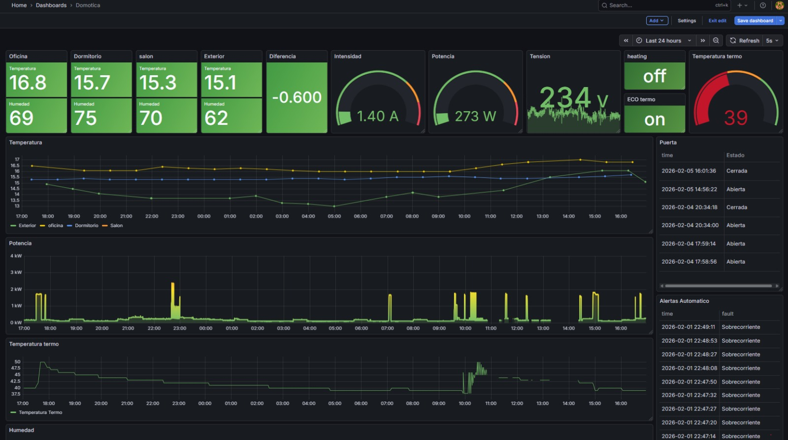
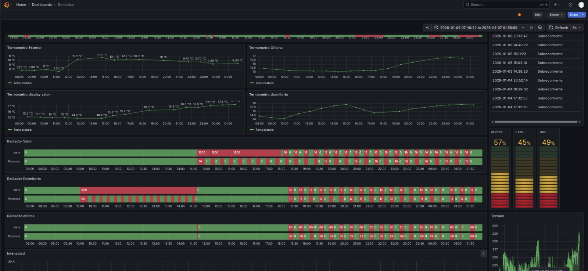

# Visualización de dispositivos Tuya y Ariston con Tinytuya, Grafana y MariaDB

Puesta en marcha:

- Copiar tu fichero devices.json obtenido con tuya "python -m tinytuya wizard" a la raiz del proyecto  "https://github.com/jasonacox/tinytuya"

- Copiar los dispositivos que se van a monitorizar a otro fichero devices.monitor.json (dispositivmos que hay que hacerles pulling cada poco)

- Crear el archivo credentials.json

- Arrancar "docker compose up"

# Creamos el entorno virtual
# lectura de termometros
termometro "nombredeldispositivo"

# Con entorno virtual
python3 -m venv .venv  ### .venv usado por poetry y vscode

source .venv/bin/activate

pip install -r requirements.txt

# devcontainer
"postCreateCommand": "python3 -m venv .venv && .venv/bin/pip install -r requirements.txt"

# Cifrar:
openssl enc -aes-256-cbc -salt -in archivo.txt -out archivo.enc

# Descifrar:
openssl enc -d -aes-256-cbc -in archivo.enc -out archivo.txt
